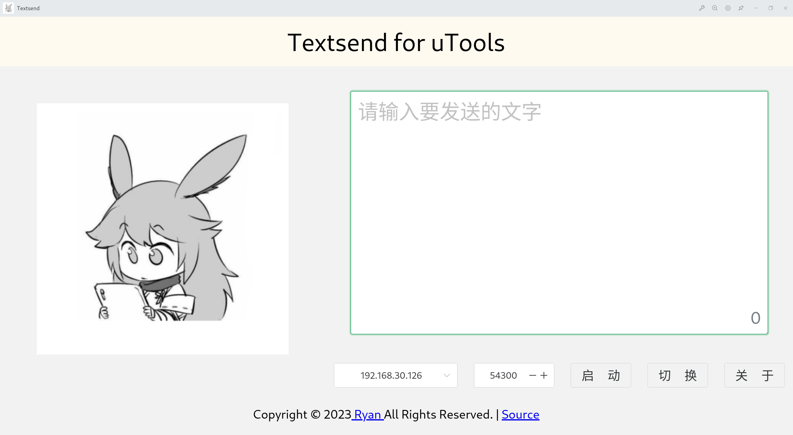
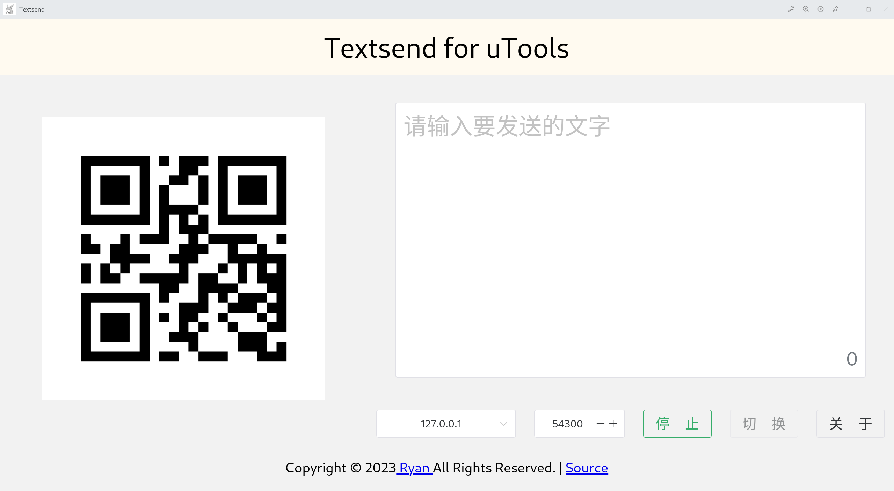
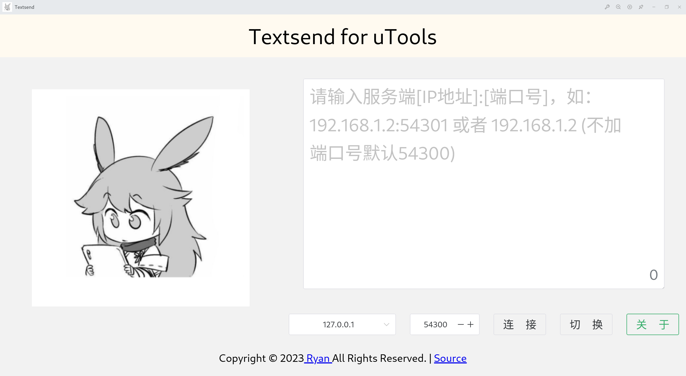

# TextSend_Utools_Plugin

本插件使用 **Vue3 + Pinia + Nodejs** 书写  |  当前版本：0.0.8

## 支持的平台

Windows / Linux ：

[Java Swing](https://github.com/rmshadows/TextSend_Desktop) | [uTools Plugin](https://github.com/rmshadows/TextSend_Utool)

安卓：

[Android](https://github.com/rmshadows/TextSend_Android)      | [演示视频](https://www.bilibili.com/video/BV1j3411q7gQ/)

## 起因

我不是专业从业者，有一天朋友突然说他在使用uTools，我想着既然Textsend已经有桌面端(基于Java Swing)、移动端(Android)了，不妨再加个插件。我个人比较常用的语言是Java和Python，因为他们容易跨平台，我主力系统是Debian GNU/Linux，身边朋友几乎都是Windows系统，所以选择了容易跨平台的语言。uTools文档我稍微翻了翻，对于我这种完全没接触过Javascript、Nodejs、Vuejs的非专业从业人员来说还是有点难。不过好在开发门槛低，我边查边写，也算是写好了，Vuejs部份的代码感谢[許景欣](https://github.com/xjx0106)的贡献。

## 关于维护

很抱歉，可能做不到维护，通过这次书写，我很深刻认识到专业与非专业的差距，所以新功能应该是很难加了，不过大家还是可以讨论。

```
局域网内的文字传输工具，会将文字直接粘贴到接收端，实现一个设备打字到另一个设备。目前有安卓端、uTools端、PC桌面端（Java Swing，支持跨平台）

Github：
uTools插件地址：https://github.com/rmshadows/TextSend_Utool
PC端：https://github.com/rmshadows/TextSend_Desktop
Android端：https://github.com/rmshadows/TextSend_Android

演示视频：
【TextSend-3.1.2-使用演示-2021年9月9日】 https://www.bilibili.com/video/BV1j3411q7gQ/?share_source=copy_web&vd_source=2f0a1572fbd3048a5eb5a17f09da604d

关于审核“启动后，其他设备无法打开此地址”的回复：
Textsend占用54300端口后（可更改端口号），其他应用自然无法再使用54300端口。同时，Textsend监听的54300端口，只能接收Textsend客户端的连接，其他应用连接匹配不上的会自动断开（防止占用），就像是在80端口开了HTTP服务，用SSH连接当然连不上一个道理。此uTools插件可以多开，通过127.0.0.1:54300连接。或者同个局域网中（本来就是设计为局域网工具），用其他Textsend客户端（安卓端或Java端）连接可连接上（防火墙要开放端口，插件开发仅在Linux做过测试，本人非专业开发人员，设备条件有限，物理机没有装Windows系统，但是朋友说在Windows系统也可以使用『嘻嘻，这个插件本来就是写给使用uTools的朋友用的』）。
```

## 目录结构

- `buildVueforuTools.sh`——一键导出Vue项目到UI文件夹供utools直接使用
- `index.html`——首页
- `LICENSE`——GPLv3
- `logo.png`——项目图标
- `package.json`——项目依赖
- `plugin.json`——utools插件集成
- `public`——公共资源
- `README.md`——本文件
- `src`——源代码
  - `App.vue`
  - `assets`
  - `components`——Vue组件
  - `js`——Vue组件的部份Js，比如和utools API交互的
  - `main.js`
  - `nodejs`——Nodejs模块
    - client1.js——测使用的Client
    - client.js——客户端组件
    - crypto.js——加密组件
    - hashcode.js——hashcode组件，用于分配客户端ID
    - maes——AES加密模块 https://github.com/rmshadows/RM_Libs
    - message.js——负责消息加密（解密是接收端的事情）
    - mqrcode——二维码模块 https://github.com/rmshadows/RM_Libs
    - profile.js——配置文件（防止循环引用）
    - qrimg.js——给utools插件调用的二维码模块
    - server1.js——测试用的服务端
    - server.js——服务端组件
    - system.js——给utools插件调用的系统组件 获取IP
  - `stores`——Pinia
- `tspreload.js`——utools的preload
- `ui`——vuejs导出的文件，utools读取的静态资源
- `vite.config.js`——vue vite配置

## Project Setup

```sh
npm install
```

### Vue3 Compile and Hot-Reload for Development

```sh
npm run dev
```

注意：使用了uTools API的可能会报错（因为没有运行在uTools中）

### Compile for Production

使用`npm run build`后移动`dist`到`ui`文件夹

推荐直接使用脚本`buildVueforuTools.sh`

### uTools调试

这个请直接看官网[文档](https://www.u.tools/docs/developer/welcome.html#plugin-json)了

# 使用说明

>注意，此插件仅用于局域网内文字互传，也就是说两个设备要在同个局域网（或者能相互访问），此插件斤支持JSON传输模式。

## 服务端模式

1. 选择IP地址和端口号，然后启动服务，会生成二维码（供安卓端APP扫码），端口号则是监听的端口（局域网内，电脑记得打开防火墙，开放监听端口）。
2. 单击（主键，主键一般是左键）启动按钮，将只允许一个客户端连接，如果是其他键（如副健、中键）将允许7个客户端连接。

## 客户端模式

1. 点击切换按钮转到客户端界面。在客户端界面输入服务端的IP地址。支持IPv4和IPv6，格式如下：

   ```
   127.0.0.1
   127.0.0.1:54300
   ::1
   [::1]:54300
   ```

2. 然后点击连接，连接成功即可传输文字。

# 更新日志

- 2024.2.11——0.0.8
  - 没有什么大更新。
  - 更新README。
  - 更新描述。

- 2024.2.3——0.0.7
  - 适配了IPv6
  - 此版本更新与0.0.6版本不兼容。
  - 此版本更新与Textsend Desktop版本4.0.3以下不兼容。
  - 此版本更新与Textsend Android版本4.0.1以下不兼容。
- 2023.09.02——0.0.6
  - 没什么大的更新
- 2023.08.28——0.0.5
  - 解决了长文本传输的问题(但连续快速发送会出错，比如连续分别发送“A”、“B”，对方只会收到“AB”)
- 2023.08.26——0.0.4
  - 第一个正式版本
  - 优化了注释
- 2023.08.10——0.0.2d
  - 界面基本完成
  - /TODO：从`vuex`迁移到`pinia`
- 2022.06.26——0.0.1d
  - 初始化了一个没用的仓库
  - 修改项目`README.md`文件内容，表明这是一个废弃的项目

# 截屏







# 开发备忘录

> 写下来免得忘了

- 由于插件使用的是Nodejs书写，只能传输JSON了，原本Java客户端传输的都是Object，但Java传输的Object到Node这边只能读不能写，所以才想出新增JSON传输模式。

- 连接的建立：

  ```
  1.服务端打开监听
  2.客户端连接成功后，服务端发送ID给客户端
  3.收到服务端给的ID后，客户端发送支持的模式到服务端
  4.服务端决定使用何种方式进行传输，告知客户端
  5.客户端以服务端告知的方式开始通信
  JSON传输格式：{"id": "xxxx", "data": "xxxx", "notes": "xxxx"}
  以上所有参数全部加密
  ```

- 文字的传输：

  ```
  1.A发送文字到B
  2.B首先检查ID是否正确，不正确的丢弃
  3.B检查无误，发送反馈信息到A
  4.A收到反馈信息后清空文本框中的内容
  ```

- Electron使用IPC通信，但utools这边似乎得用preload加载出子窗口后，preload加载的窗口才能向子窗口发送数据（就是我注释掉的那些IPC代码），具体看utools文档 => [这里](https://www.u.tools/docs/developer/api.html#%E7%A4%BA%E4%BE%8B-21)。到底，也就是主线程如何与渲染线程通讯的问题。

- 因为上面提到的IPC通讯麻烦，所以我直接在vue这边轮询preload里面的接口了，是占用资源了。。。。


